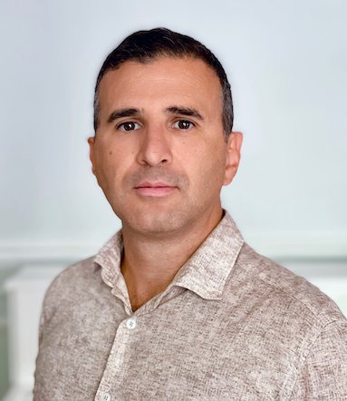

# Luca Muscariello

{ align=left width="150" style="border-radius: 50%; margin-right: 20px;" }

**Distinguished Engineer at Cisco Systems**

---

## Short Bio

Luca Muscariello received his MS in 2002 and PhD in 2006 in Electrical Engineering and Computer Science from Politecnico di Torino, Italy. He is currently a Distinguished Engineer at Cisco Systems, where he leads engineering efforts in Emerging Technologies and Incubation, driving internal venture ideation and development to accelerate innovation across Cisco's product portfolio.

Previously, Luca spent a decade at Orange Labs (formerly France Telecom R&D), conducting research in quality of service, traffic management, and traffic engineering for both fixed and mobile networks. He has also served as a research associate at IRT SystemX and as a permanent member of the Laboratory for Information, Networking and Communication Sciences (LINCS) in Paris.

Luca has authored over sixty publications in top-tier journals and conferences, including IEEE/ACM Transactions, Elsevier Science journals, ACM SIGCOMM ICN, ACM SIGMETRICS, and IEEE INFOCOM. He has held leadership roles in several international conferences, serving as program co-chair of IEEE LANMAN 2018, general co-chair of IEEE LANMAN 2019, program co-chair of Valuetools 2013, and both program and general co-chair of ACM SIGCOMM ICN 2014. He was a member of the ACM SIGCOMM ICN steering committee until 2016 and currently serves on the steering committee of IEEE LANMAN.

He has led two open source projects under FD.io (Fast Data) within the Linux Foundation Networking Fund, focusing on high-performance implementations of ICN network and transport stacks. Luca has supervised numerous interns and five PhD students, and remains deeply engaged in mentoring and technical leadership.

He is a senior member of ACM, IEEE, and SEE, and serves on the technical steering committees of the Linux Foundation projects AGNTCY and A2A.

---

## Contact

- [GitHub](https://github.com/muscariello)
- [LinkedIn](https://www.linkedin.com/in/luca-muscariello-ab3546)
